# アイテムリスト チェック結果

まつごろうさん作のアイテムリストの内容を精査してみました。  
[https://docs.google.com/spreadsheets/d/1gPW73jMtGr-aNjO5dE3lQLGo80-4QAqts4DBXBKWeMM/edit#gid=1243711132]

※ `E2`や`N2`などはスプレッドシートのセル座標です  
(クリックするとスプレッドシートの該当セルに直で飛びます)。  
※ 裏どり用の画像は折りたたんであります。見たい項目だけクリックして開いてください。

---

### 1. [E2](https://docs.google.com/spreadsheets/d/1gPW73jMtGr-aNjO5dE3lQLGo80-4QAqts4DBXBKWeMM/edit#gid=1243711132&range=E2)「豪華な肉料理」 / [N2](https://docs.google.com/spreadsheets/d/1gPW73jMtGr-aNjO5dE3lQLGo80-4QAqts4DBXBKWeMM/edit#gid=1243711132&range=N2)(材料2)
`生肉2 穀物全般4 大豆4` → `生肉2 穀物全般4 豆全般4`

大豆も豆全般の一部なので嘘ではないです。

📷 画像を見る

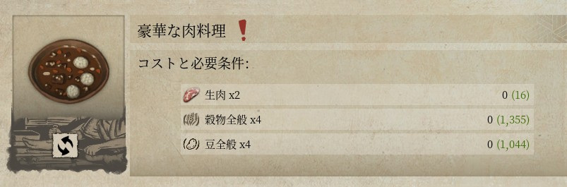

---

### 2. [E11](https://docs.google.com/spreadsheets/d/1gPW73jMtGr-aNjO5dE3lQLGo80-4QAqts4DBXBKWeMM/edit#gid=1243711132&range=E11)「質素な魚料理」 / [O11](https://docs.google.com/spreadsheets/d/1gPW73jMtGr-aNjO5dE3lQLGo80-4QAqts4DBXBKWeMM/edit#gid=1243711132&range=O11)(材料3)
`魚1 薬草全般3 穀物全般1` → `(空)`

質素な魚料理のレシピは2つなので、3つ目にあたるこのレシピは存在しません。

📷 画像を見る

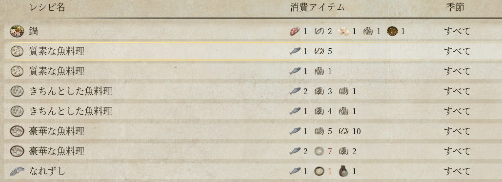

---

### 3. [E63](https://docs.google.com/spreadsheets/d/1gPW73jMtGr-aNjO5dE3lQLGo80-4QAqts4DBXBKWeMM/edit#gid=1243711132&range=E63)「油」 / [N63](https://docs.google.com/spreadsheets/d/1gPW73jMtGr-aNjO5dE3lQLGo80-4QAqts4DBXBKWeMM/edit#gid=1243711132&range=N63)(材料2)
`菜種` → `菜種3+水1`

「搾油」の材料が一部記入漏れしていました。

📷 画像を見る

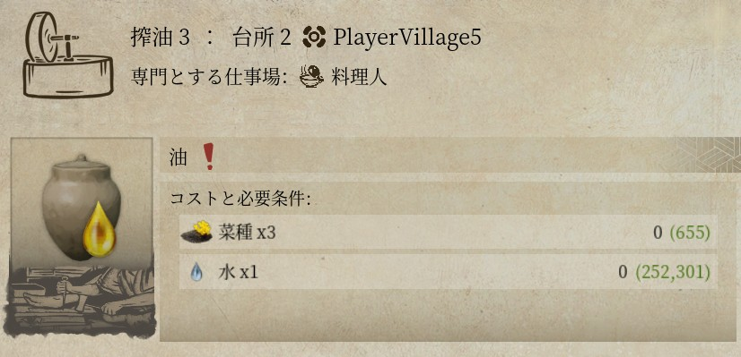

---

### 4. [E66](https://docs.google.com/spreadsheets/d/1gPW73jMtGr-aNjO5dE3lQLGo80-4QAqts4DBXBKWeMM/edit#gid=1243711132&range=E66)「樹皮」 / [L66](https://docs.google.com/spreadsheets/d/1gPW73jMtGr-aNjO5dE3lQLGo80-4QAqts4DBXBKWeMM/edit#gid=1243711132&range=L66)(クラフト場所)
`大工作業台` → `大工作業台,採集者の仕事場`

採集者の仕事場に村人を割り当てる事でも入手出来ます。

### 5. [E67](https://docs.google.com/spreadsheets/d/1gPW73jMtGr-aNjO5dE3lQLGo80-4QAqts4DBXBKWeMM/edit#gid=1243711132&range=E67)「枝」 / [L67](https://docs.google.com/spreadsheets/d/1gPW73jMtGr-aNjO5dE3lQLGo80-4QAqts4DBXBKWeMM/edit#gid=1243711132&range=L67)(クラフト場所)
`大工作業台` → `大工作業台,採集者の仕事場`

採集者の仕事場に村人を割り当てる事でも入手出来ます。

### 6. [E68](https://docs.google.com/spreadsheets/d/1gPW73jMtGr-aNjO5dE3lQLGo80-4QAqts4DBXBKWeMM/edit#gid=1243711132&range=E68)「梶の樹皮」 / [L68](https://docs.google.com/spreadsheets/d/1gPW73jMtGr-aNjO5dE3lQLGo80-4QAqts4DBXBKWeMM/edit#gid=1243711132&range=L68)(クラフト場所)
`大工作業台` → `大工作業台,採集者の仕事場`

採集者の仕事場に村人を割り当てる事でも入手出来ます。

📷 4〜6 まとめて画像を見る

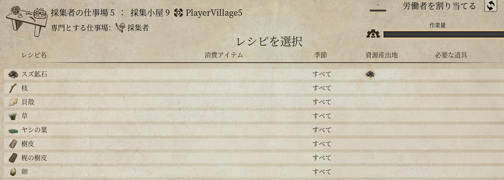

---

### 7. [E84](https://docs.google.com/spreadsheets/d/1gPW73jMtGr-aNjO5dE3lQLGo80-4QAqts4DBXBKWeMM/edit#gid=1243711132&range=E84)「水」 / [W84](https://docs.google.com/spreadsheets/d/1gPW73jMtGr-aNjO5dE3lQLGo80-4QAqts4DBXBKWeMM/edit#gid=1243711132&range=W84)(備考)
`レシピ当たり50個クラフト` → `50または1`

- プレイヤーが井戸にインタラクトして入手する場合(50)
- 村人に作業を指示して入手する場合(1 x 作業回数 x 各種補正)

📷 画像を見る

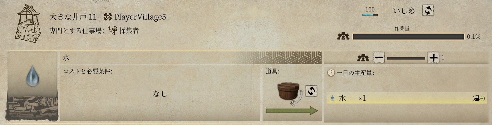
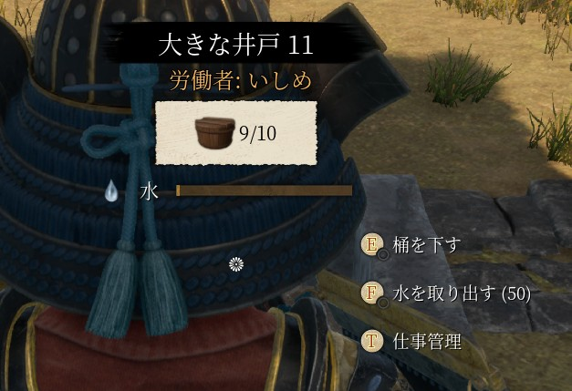

---

### 8. [E79](https://docs.google.com/spreadsheets/d/1gPW73jMtGr-aNjO5dE3lQLGo80-4QAqts4DBXBKWeMM/edit#gid=1243711132&range=E79)「焼酎」 / [M79](https://docs.google.com/spreadsheets/d/1gPW73jMtGr-aNjO5dE3lQLGo80-4QAqts4DBXBKWeMM/edit#gid=1243711132&range=M79)(材料1) / [W79](https://docs.google.com/spreadsheets/d/1gPW73jMtGr-aNjO5dE3lQLGo80-4QAqts4DBXBKWeMM/edit#gid=1243711132&range=W79)(備考)
`レシピ当たり2個クラフト` → `4または6`

- プレイヤーが焼酎蒸留所にインタラクトして入手する場合、もろみ2 → 焼酎4
- 村人に作業を指示して入手する場合、(6 x 作業回数 x 各種補正)

変換レート自体は正しいですが、もろみが奇数個の場合は生産が行えません。

📷 画像を見る

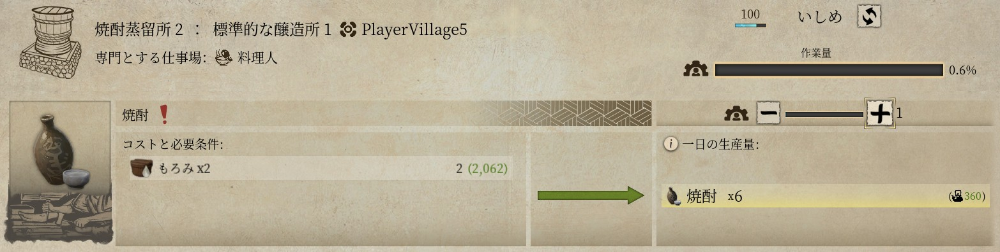
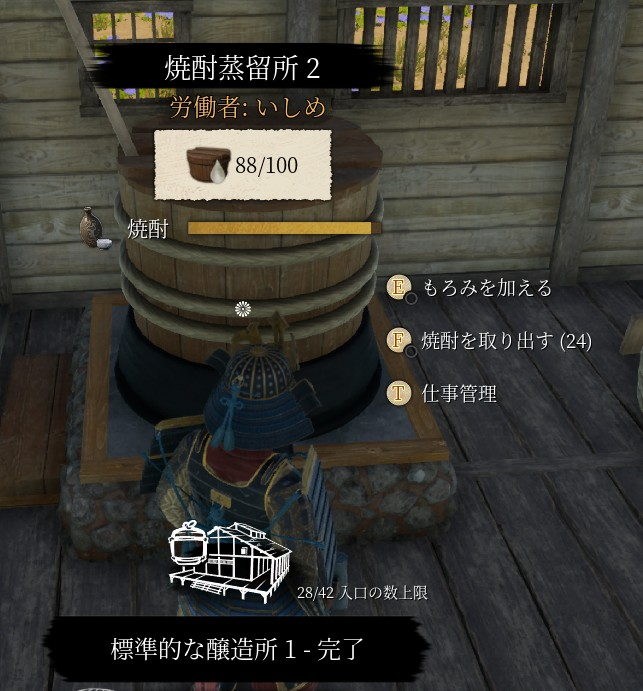
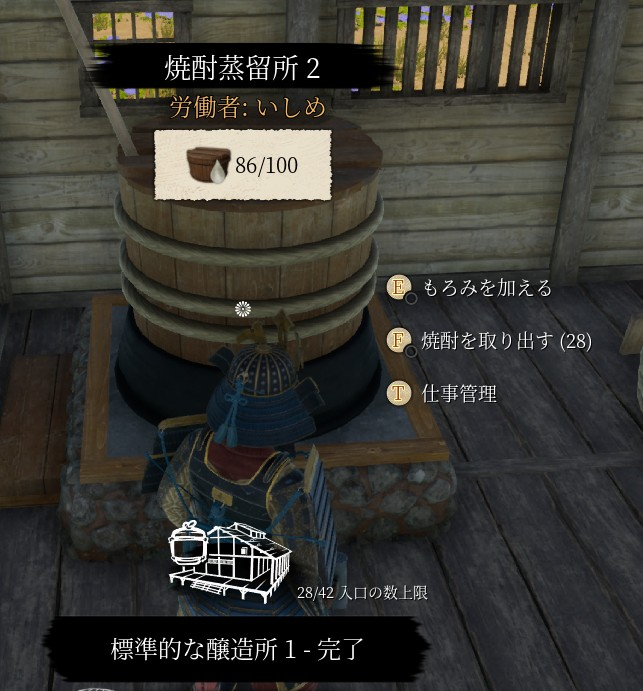

---

### 9. [E80](https://docs.google.com/spreadsheets/d/1gPW73jMtGr-aNjO5dE3lQLGo80-4QAqts4DBXBKWeMM/edit#gid=1243711132&range=E80)「日本酒」 / [W80](https://docs.google.com/spreadsheets/d/1gPW73jMtGr-aNjO5dE3lQLGo80-4QAqts4DBXBKWeMM/edit#gid=1243711132&range=W80)(備考)
`レシピ当たり2個クラフト` → `2または4`

- プレイヤーが焼酎蒸留所にインタラクトして入手する場合、もろみ1 → 日本酒2
- 村人に作業を指示して入手する場合、(4 x 作業回数 x 各種補正)

📷 画像を見る

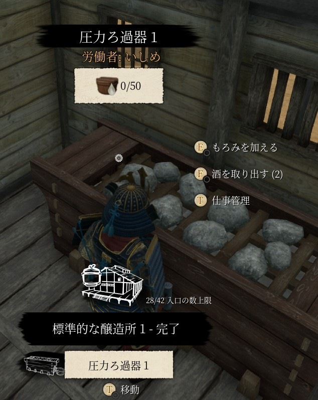
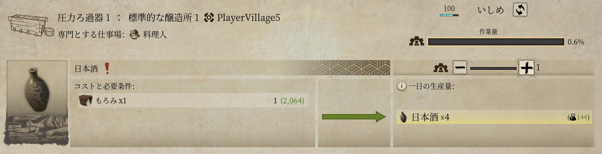

---

### 10. [E107](https://docs.google.com/spreadsheets/d/1gPW73jMtGr-aNjO5dE3lQLGo80-4QAqts4DBXBKWeMM/edit#gid=1243711132&range=E107)「僧の被り物」 / [I107](https://docs.google.com/spreadsheets/d/1gPW73jMtGr-aNjO5dE3lQLGo80-4QAqts4DBXBKWeMM/edit#gid=1243711132&range=I107)(要求充足度)
`150` → `300`

📷 画像を見る

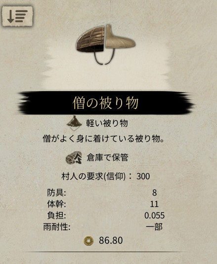

---

### 11. [E161](https://docs.google.com/spreadsheets/d/1gPW73jMtGr-aNjO5dE3lQLGo80-4QAqts4DBXBKWeMM/edit#gid=1243711132&range=E161)「紙」 / [W161](https://docs.google.com/spreadsheets/d/1gPW73jMtGr-aNjO5dE3lQLGo80-4QAqts4DBXBKWeMM/edit#gid=1243711132&range=W161)(備考)
`レシピ当たり4個クラフト` → `レシピ当たり4個または5個クラフト`

クラフト場所「小さな乾燥棚」は4個、「大きな乾燥棚」は5個。

📷 画像を見る

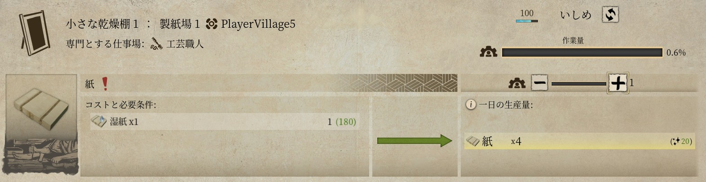

---

### 12. [E162](https://docs.google.com/spreadsheets/d/1gPW73jMtGr-aNjO5dE3lQLGo80-4QAqts4DBXBKWeMM/edit#gid=1243711132&range=E162)「ろうそく」 / [W162](https://docs.google.com/spreadsheets/d/1gPW73jMtGr-aNjO5dE3lQLGo80-4QAqts4DBXBKWeMM/edit#gid=1243711132&range=W162)(備考)
`レシピ当たり4個クラフト` → `レシピ当たり4個または6個クラフト`

材料1(脂肪1+藁1)は4個、材料2(蜜蝋1+藁1)は6個。

📷 画像を見る

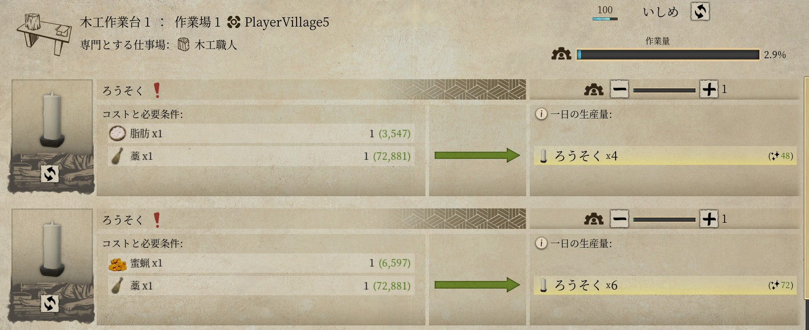

---

### 13. [E140](https://docs.google.com/spreadsheets/d/1gPW73jMtGr-aNjO5dE3lQLGo80-4QAqts4DBXBKWeMM/edit#gid=1243711132&range=E140)「真珠」 / [L140](https://docs.google.com/spreadsheets/d/1gPW73jMtGr-aNjO5dE3lQLGo80-4QAqts4DBXBKWeMM/edit#gid=1243711132&range=L140)(クラフト場所)
`仕立て台` → `(空)`

真珠の生産レシピは存在しません(貝殻のレアドロップ)。

---

### 14. [E156](https://docs.google.com/spreadsheets/d/1gPW73jMtGr-aNjO5dE3lQLGo80-4QAqts4DBXBKWeMM/edit#gid=1243711132&range=E156)「円筒提灯」(名称)
`円筒提灯` → `円筒提燈`

漢字の修正。

### 15. [E157](https://docs.google.com/spreadsheets/d/1gPW73jMtGr-aNjO5dE3lQLGo80-4QAqts4DBXBKWeMM/edit#gid=1243711132&range=E157)「小さな提灯」(名称)
`小さな提灯` → `小さな提燈`

漢字の修正。

📷 14〜15 まとめて画像を見る

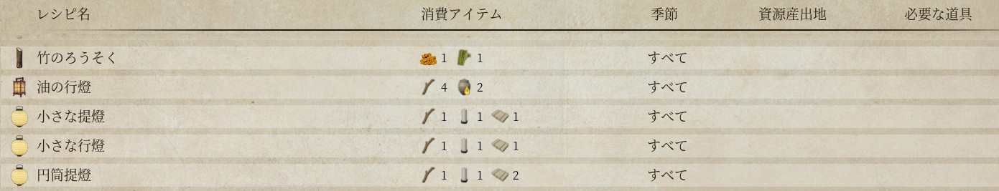

---

### 16. [E171](https://docs.google.com/spreadsheets/d/1gPW73jMtGr-aNjO5dE3lQLGo80-4QAqts4DBXBKWeMM/edit#gid=1243711132&range=E171)「飾り付きの印籠」(名称)
`飾り付きの印籠` → `飾りつきの印籠`

同じ設備で作れる「足袋付きの草鞋」と送り仮名が揃っていない罠。

📷 画像を見る

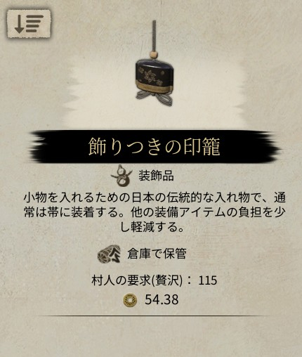

---

### 17. [E185](https://docs.google.com/spreadsheets/d/1gPW73jMtGr-aNjO5dE3lQLGo80-4QAqts4DBXBKWeMM/edit#gid=1243711132&range=E185)「鴉天狗の面」(名称)
`鴉天狗の面` → `烏天狗の面`

📷 画像を見る

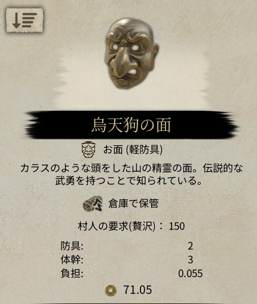

